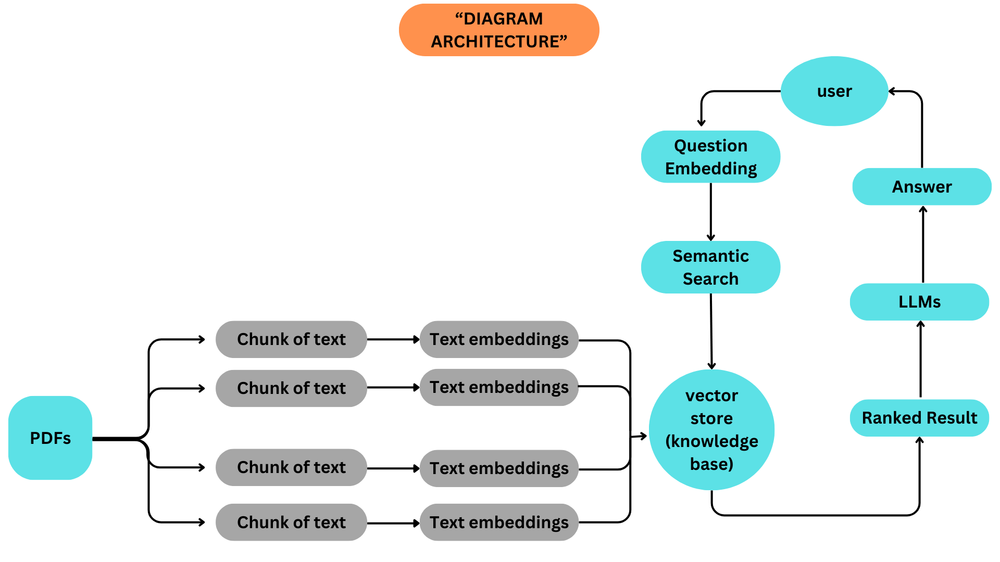

# AI ChatbotPDF

## Project Description
ChatbotPDF AI is an application that allows users to upload multiple PDF documents and interact with a chatbot that can answer questions based on the contents of those documents.

## Main Features
- Uploading and processing multiple PDF documents.
- Splits text into smaller pieces for further processing.
- Converts text into embeddings using the `HuggingFaceEmbeddings` model.
- Stores the embedding in the `FAISS` vector store.
- Using the LLM model `Ollama` to manage interactive conversations.

## Technologies Used
- `Streamlit`: For the user interface.
- `PyPDF2`: For text extraction from PDF.
- `langchain`: For NLP and conversational memory management.
- `sentence-transformers`: For text embedding.
- `FAISS`: For embedding storage and quick search.
